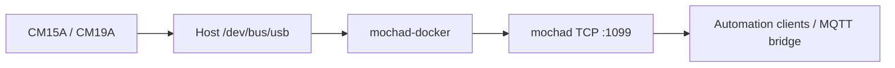

# mochad-docker

[](https://github.com/Monsterray/mochad-docker/actions/workflows/ci.yml)
[](https://github.com/Monsterray/mochad-docker/releases)
[](LICENSE.md)

A non-root Docker image for running `mochad-redux` with X10 USB controllers.

## Project Family

- [mochad-redux](https://github.com/Monsterray/mochad-redux): the daemon,
  USB/controller support, X10 protocols, and native Linux installation.
- **mochad-docker**: image construction, USB passthrough, container
  permissions, Compose examples, and OCI metadata.
- [mochad-mqtt-bridge](https://github.com/Monsterray/mochad-mqtt-bridge):
  MQTT and Home Assistant integration over the main mochad TCP listener.

## Highlights

- Builds a selected `mochad-redux` repository, tag, branch, or exact commit.
- Runs the daemon as a configurable non-root identity.
- Maps the host USB bus without requiring privileged mode.
- Detects or accepts the host USB group ID independently from the runtime GID.
- Preserves native port `1099` and optional legacy ports `1100` and `1101`.
- Includes a TCP health check and concise USB permission diagnostics.
- Produces `linux/amd64` and `linux/arm64` release images with traceable inputs.

## Quick Start

Clone the repository and create the local environment:

```sh
git clone https://github.com/Monsterray/mochad-docker.git
cd mochad-docker
cp .env.example .env
```

Connect a CM15A or CM19A, then start the local build:

```sh
docker compose up --build -d
docker compose logs -f mochad
```

The supplied Compose service includes the required USB bus mount and USB
character-device rule:

```yaml
volumes:
  - /dev/bus/usb:/dev/bus/usb
device_cgroup_rules:
  - "c 189:* rwm"
```

Verify the main listener from the host:

```sh
nc -vz localhost 1099
```

Expected result: the connection succeeds. New clients, including the MQTT
bridge, should use port `1099`.

### USB Requirements

Host udev should create X10 controller nodes as `root:x10` mode `0660`. The
recommended native `mochad-redux` setup installs this policy. To configure it
manually, create the `x10` group, apply the reviewed udev rules, and set
`USB_GID=auto` or the host group's numeric ID.

```sh
getent group x10
ls -l /dev/bus/usb/*/*
```

The container validates read/write access after dropping privileges and fails
clearly when the mapped node is inaccessible. `USB_DEBUG=true` prints every
mapped USB node; normal startup logs only the detected X10 controller.

## Architecture



This repository packages the daemon but does not own X10 protocol behavior.
The image clones and builds `mochad-redux`; runtime clients connect over TCP.
The Compose service name remains `mochad`, allowing the bridge to use
`MOCHAD_HOST=mochad` on a shared Docker network.

Port `1100` is the legacy Flash XMLSocket-compatible listener. It uses
NUL-delimited framing rather than structured XML. Port `1101` preserves the
OpenRemote listener. Both remain enabled by default for compatibility and can
be disabled independently.

## Requirements

- Docker Engine with Compose v2.
- Linux host access to `/dev/bus/usb`.
- X10 CM15A (`0bc7:0001`) or CM19A (`0bc7:0002`) hardware for controller use.
- Host udev permissions that permit the configured USB group to access the
  controller.
- TCP port `1099`, plus `1100` and `1101` when legacy listeners are published.

## Common Configuration

The most frequently changed values are:

| Variable | Default | Purpose |
| --- | --- | --- |
| `PUID` / `PGID` | `911` / `911` | Runtime identity |
| `USB_GID` | `auto` | Supplementary group for the USB node |
| `UMASK` | `022` | Runtime file-creation mask |
| `TZ` | `UTC` | Container timezone |
| `MOCHAD_BIND` | `0.0.0.0` | Listener bind address |
| `MOCHAD_PORT` | `1099` | Main TCP listener |
| `MOCHAD_XML_ENABLED` | `true` | Enable legacy XMLSocket listener |
| `MOCHAD_OPENREMOTE_ENABLED` | `true` | Enable OpenRemote listener |

`MOCHAD_FOREGROUND=true` keeps the daemon attached for container supervision.
Use `MOCHAD_BIND=::` for explicit IPv6 opt-in; Docker and kernel policy may
still prevent dual-stack publishing.

Build-time inputs such as `MOCHAD_REPOSITORY`, `MOCHAD_REF`, the exact source
SHA, and the Alpine base are separate from runtime settings. Changing them
requires an image rebuild. The complete catalog is in
[configuration](docs/configuration.md).

If Compose `user:` is set, it bypasses `PUID`/`PGID` initialization. Pre-own
volumes and provide `group_add` explicitly in that advanced mode.

## Project Status

The packaging version comes from [VERSION](VERSION). The embedded daemon
version and source SHA are tracked separately in
[release/versions.env](release/versions.env) and image metadata.

The current `0.4.x` line is a cautious public beta. CI validates both supported
architectures, metadata, permissions, and CLI startup. Physical USB operation
requires separately recorded CM15A or CM19A evidence.

For release testing, use `ghcr.io/monsterray/mochad-docker:0.4.0` or exact
immutable build inputs, not a moving branch. Confirm the tag exists in GHCR.
See [compatibility](docs/compatibility.md) and [release evidence](RELEASE_EVIDENCE.md).

## Documentation

- [Configuration reference](docs/configuration.md)
- [Compatibility and version mapping](docs/compatibility.md)
- [Release engineering](docs/release-engineering.md)
- [Release checklist](RELEASE_CHECKLIST.md)
- [Security policy](SECURITY.md)
- [Contribution guide](CONTRIBUTING.md)

## Development and Testing

Build the local image:

```sh
docker compose build
docker compose config --quiet
```

Build the reviewed release inputs:

```sh
docker compose --env-file release/versions.env build
```

Test an exact Redux commit by setting `MOCHAD_REPOSITORY` and `MOCHAD_REF` in
`.env`, then rebuilding without cache. `MOCHAD_REF` may be a branch, tag, or
SHA; full SHAs are preferred for repeatable validation.

CI validates Compose, source identity, runtime permissions, filesystem
ownership, packages, metadata, health checks, and both target architectures.
It does not duplicate the daemon's protocol unit tests.

## Related Projects

- [mochad-redux](https://github.com/Monsterray/mochad-redux)
- [mochad-mqtt-bridge](https://github.com/Monsterray/mochad-mqtt-bridge)
- [Original mochad project](https://sourceforge.net/projects/mochad/)

## Contributing

Read [CONTRIBUTING.md](CONTRIBUTING.md) before opening a change. Packaging
reports should include the exact image tag or SHA, architecture, controller
VID:PID, Compose configuration, USB node ownership, sanitized logs, and
rollback result.

## License

The Docker packaging is MIT licensed. The built image contains
`mochad-redux`, licensed `GPL-3.0-or-later`, under a separate license path.
See [LICENSE.md](LICENSE.md) and
[release engineering](docs/release-engineering.md).
